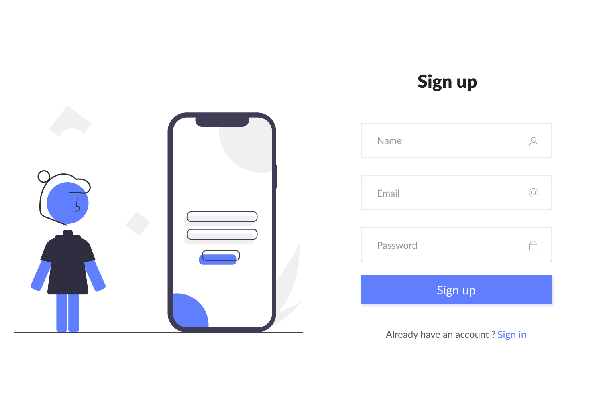

# Find this project live [here 👈](https://stunningform.netlify.app/)

## This project has a satisfying transition. The vast amount of code is tricky CSS or SASS stuff. Additionally, It's fully responsive.

<br>

## **Language :**

- HTML5
- CSS3
- Vanilla JS

## **Tools and technology :**

- Adobe illustrator
- Figma
- raw svg

## **Validation :**

- HTML5 `[validator.w3.org]`
- CSS3 `[igsaw.w3.org]`
- Js `[babel]`

<br>

# Script Highlights :

```javascript
Dom selectors, event.clientX,
 event.clientY,
event.target.offsetTop, event.target.offsetLeft
```
