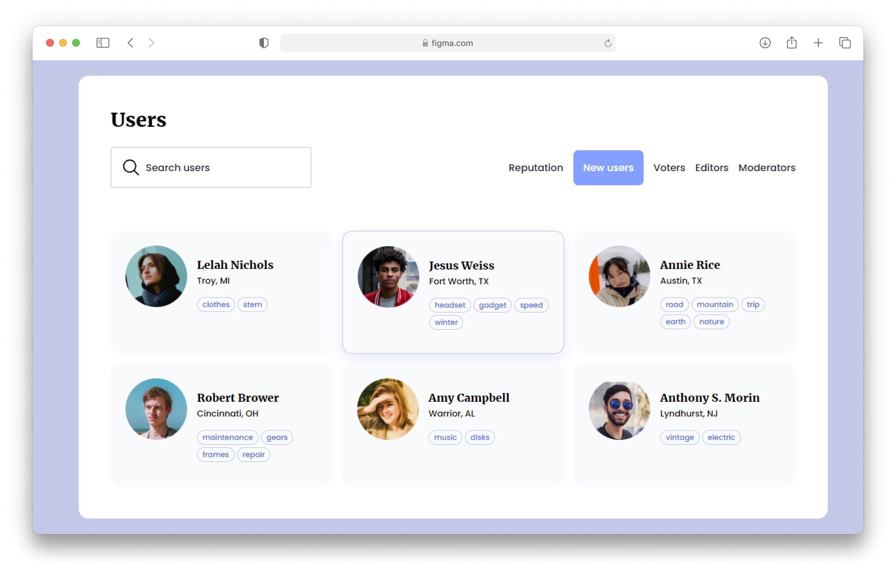

# UI Design Daily - User List (Day 1542)

- [UI Design Daily - User List (Day 1542)](#ui-design-daily---user-list-day-1542)
  - [Overview](#overview)
    - [The design](#the-design)
    - [Screenshot](#screenshot)
    - [Links](#links)
  - [My process](#my-process)
    - [Built with](#built-with)
    - [Useful resources](#useful-resources)
  - [Author](#author)

## Overview

### The design

[Users List](https://www.uidesigndaily.com/posts/figma-users-list-card-day-1542)

### Screenshot

### Links

- Code URL: [GitHub](https://github.com/SalahuddinAhammed/frontend-mentor-solutions/tree/main/projects/users-list)
- Live Site URL: [Netlify](https://design-to-code-salahuddin.netlify.app/users-list)

## My process

### Built with

- Semantic HTML5 markup
- CSS custom properties
- Flexbox
- CSS Grid
- CSS BEM Methodology

### Useful resources

- [CSS BEM Methodology](http://getbem.com/) - This helped me for naming CSS classes.
- [CSS Custom Properties](https://developer.mozilla.org/en-US/docs/Web/CSS/Using_CSS_custom_properties)

## Author

- GitHub - [Salahuddin Ahammed](https://github.com/SalahuddinAhammed)
